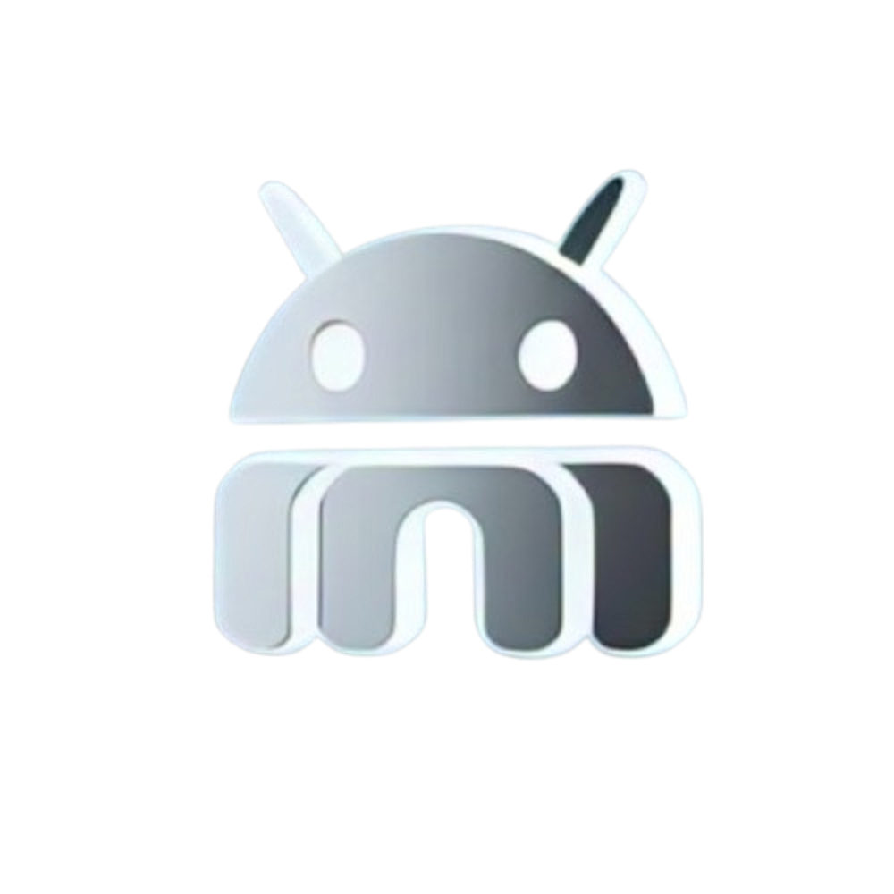
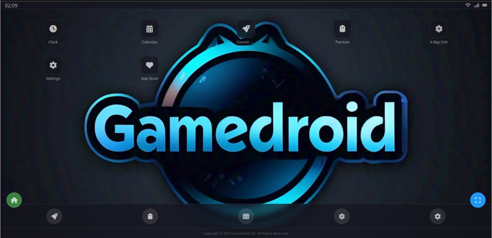
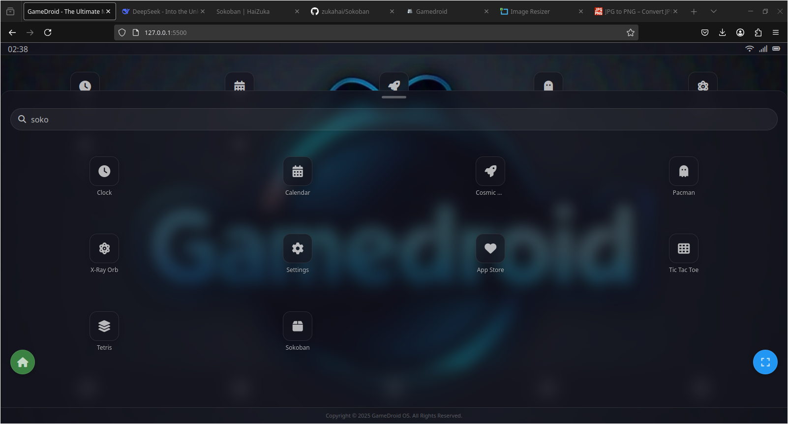

# 🎮 GameDroid OS

<div align="center">
  

  [](https://opensource.org/licenses/MIT)
  [](CONTRIBUTING.md)
  [](https://github.com/thegamedroidos/thegamedroidos.github.io)
  
  <h3>The Ultimate Mobile Gaming Experience in Your Browser. It's A Great Place For Sharing Your Open-source Web Apps and Games To Our Lovely Audience.</h3>
  
  <b>Play classic,retro and modern games in a beautiful mobile OS interface.</b>
  
  [Live Demo](https://thegamedroidos.github.io) | [Documentation](https://thegamedroidos.github.io/comingsoon.html) | [Contributing](CONTRIBUTING.md)
</div>

## 🌟 Overview

GameDroid OS recreates the mobile gaming experience right in your web browser with android ui. With a sleek, customizable interface and a growing library of games, it brings the best of mobile gaming to any device. Whether you're into classics like Pac-Man and Tetris or new titles like Cosmic Dash and X-Ray Orb, GameDroid has something for everyone.

<div align="center">
  
</div>

## ✨ Features

- **📱 Authentic Mobile Experience** - Complete with status bar, app grid, and dock
- **🎮 Rich Game Library** - Multiple built-in games with easy expansion
- **🎨 Customizable Interface** - Change wallpapers, themes, icon sizes, and more
- **🔍 App Search** - Find your favorite games instantly
- **🌓 Dark/Light Themes** - Switch between modes for comfortable gaming any time
- **⚡ Performance Optimized** - Fast loading and smooth gameplay
- **📊 SEO Ready** - Built with discoverability in mind
- **📱 Responsive Design** - Perfect on any screen, from phones to desktops

## 🚀 Quick Start

```bash
# Clone the repository
git clone https://github.com/yourname/gamedroid.git

# Navigate to project directory
cd gamedroid

# Launch with your favorite server
# For example, with Python:
python -m http.server

# Or just open index.html in your browser
```

## 🎮 Available Games

- **Cosmic Dash** - Thrilling space adventure
- **Pac-Man** - The arcade classic
- **X-Ray Orb** - Puzzle solver with a twist
- **Tic Tac Toe** - Simple but engaging
- **Tetris** - Timeless block stacking challenge
- **Sokoban** - Strategic box-pushing puzzle
- **App Centre** - More games to come

<div align="center">
  
</div>

## 🛠️ Customization

GameDroid OS offers extensive customization options:

- **🎨 Multiple Wallpapers** - Choose from 6 beautiful backgrounds
- **🌗 Light/Dark Mode** - Toggle between themes
- **📐 Grid Size** - Adjust your home screen layout
- **📱 Icon Size** - Pick what works best for your device
- **🔠 Font Size** - Optimize readability

## 👨‍💻 For Developers

GameDroid is built with vanilla JavaScript, making it perfect for web developers of all levels to experiment with:

```javascript
// Easy to add new games
const myNewGame = { 
  id: 'mygame', 
  name: 'My Awesome Game', 
  icon: 'fas fa-gamepad' 
};

// Simple integration with existing structure
```

**Want to contribute?** We welcome indie web developers to join our project!

[See our CONTRIBUTING.md](CONTRIBUTING.md) for how to get started.

## 📚 Tech Stack

- **HTML5** - Semantic structure
- **CSS3** - Modern styling with variables
- **JavaScript** - Vanilla JS (no frameworks)
- **Font Awesome** - Beautiful iconography
- **LocalStorage API** - Preference persistence

## 📄 License

GameDroid OS is released under the MIT License. See the [LICENSE](LICENSE) file for details.

---

<div align="center">
  <p>Made with ❤️ by GameDroid Team</p>
  <p>Have questions? Want to contribute? Check out our <a href="CONTRIBUTING.md">contribution guide</a>!</p>
</div>